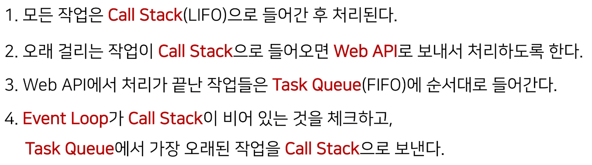

# JavaScript - Asynchronous

💡 동기와 비동기, 콜백함수 공부하기

## 동기(Synchronous)

- 모든 일을 순서대로 하나씩 처리하는 것!
- 이전 작업이 끝나야 다음 작업을 시작함

## 비동기(Asynchronous)

- 작업을 시작한 후 결과를 기다리지 않고 다음 작업을 처리하는 것!
- 병렬적 수행
- 시간이 필요한 작업 : 요청을 보낸 뒤 응답이 빨리 오는 작업부터 처리

```javascript
function taskA() {
  // 자바스크립트 내 setTimeout 내장 비동기함수
  // 파라미터로 콜백함수와 delay time(ms단위) 넣어주면 된다! 1000ms = 1초
  setTimeout(() => {
    console.log("A TASK END");
  }, 2000);
}

function taskB(a, b, callback) {
  setTimeout(() => {
    const res = a + b;
    callback(res);
  }, 3000);
}

function taskC(a, callback) {
  setTimeout(() => {
    const res = a * 2;
    callback(res);
  }, 1000);
}

function taskD(a, callback) {
  setTimeout(() => {
    const res = a * -1;
    callback(res);
  }, 2000);
}

taskA();
console.log("A 코드 끝"); // 코드 끝이 먼저 출력된 후 A TASK END 출력됨!(비동기 방식)
taskB(3, 4, (res) => {
  console.log("B TASK RESULT :", res);
});
console.log("B 코드 끝");
taskC(7, (res) => {
  console.log("C TASK RESULT :", res);
});
console.log("C 코드 끝");
taskD(14, (res) => {
  console.log("D TASK RESULT :", res);
});
console.log("D 코드 끝");


// 출력결과
// A 코드 끝
// B 코드 끝
// C 코드 끝
// D 코드 끝
// C TASK RESULT : 14
// A TASK END
// D TASK RESULT : -14
// B TASK RESULT : 7
```

## 브라우저 환경에서의 Js 비동기처리 동작 방식



- Call Stack
  - 요청이 들어올 때마다 순차적으로 처리하는 Stack(LIFO)
  - 기본적인 JavaScript의 Single Thread 작업 처리
- Web API
  - 브라우저에서 제공하는 runtime 환경
  - 시간이 소요되는 작업을 처리함!
  - ex) setTimeout, DOM Event, AJAX 요청 등
- Task Queue
  - 비동기 처리된 Callback함수가 대기하는 Queue(FIFO)
- Event Loop
  - Call Stack과 Task Queue를 지속적으로 모니터링함
  - Call Stack이 비어 있는지 확인 후 비어있으면 Task Queue에 대기 중인 작업 중 가장 오래된 작업을 Call Stack으로 Push

## 비동기 처리 동작 과정

- 모든 작업은 call stack에서 pop되면서 작업 수행됨!
- 너무 오래걸리는 작업이 call stack에 들어오면 web API로 보내주고 다음 작업 수행
- web API에서 처리가 끝나면 Task Queue에 넣어줌
- Event Loop가 Call Stack이 비어있는지 감시하고있다가, 얘가 비게되면 task Queue에 가장 먼저 들어온 작업을 call stack으로 보냄!
- 3초 뒤에 출력이 된다는 뜻x, 3초 뒤에 task queue에 보내지는 것, 만약에 아직 처리해야할 작업이 call stack에 남아있으면 3초보다 더 오래 걸릴수도 있음

## 콜백 함수

- 다른 함수의 인자로 전달되는 함수
- 동기, 비동기 상관없이 사용 가능함!
- 시간이 걸리는 비동기 작업이 완료된 후 실행할 작업을 명시하는데 사용하는 콜백 함수를 비동기 콜백이라고 부름
- 콜백함수들은 어떤 요청이 일어나는 시점에 실행이 됨! 그래서 비동기에 콜백함수를 사용하면 순서를 컨트롤할 수 있음

```javascript
// -> 비동기 처리의 결과를 또 다른 비동기 처리의 값으로 전달할 수 있음
// 이렇게 콜백함수를 계속 연달아 쓰다보면 콜백지옥이 된다...
taskB(4, 5, (b_res) => {
  console.log("B 두번째 결과 :", b_res);
  taskC(b_res, (c_res) => {
    console.log("C 두번째 결과 :", c_res);
    taskD(c_res, (d_res) => {
      console.log("D 두번째 결과 :", d_res);
    });
  });
});


// 출력 결과
// B 두번째 결과 : 9
// C 두번째 결과 : 18
// D 두번째 결과 : -18
```

## 콜백함수를 사용하는 이유

- 특정한 조건 or 행동에 의해 호출되도록 작성할 수 있음!
- 비동기 처리를 순차적으로 동작할 수 있게 함!!
- 비동기 처리를 위해서는 콜백함수의 형태가 반드시 필요!!
