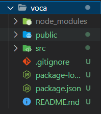
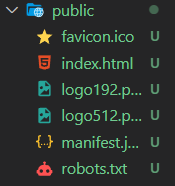
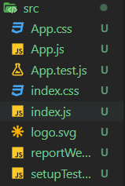
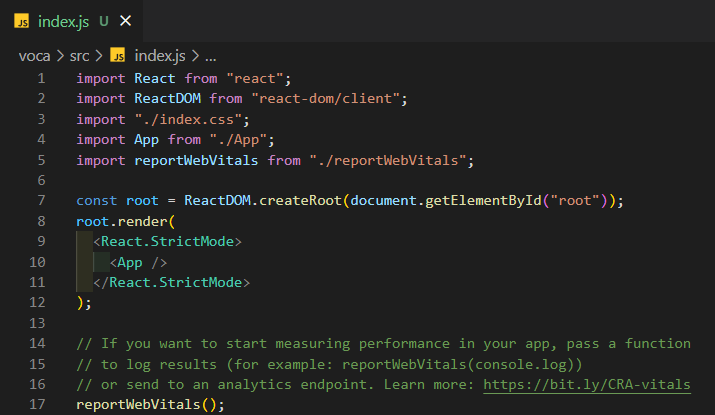
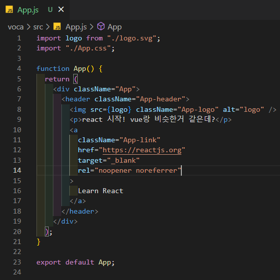
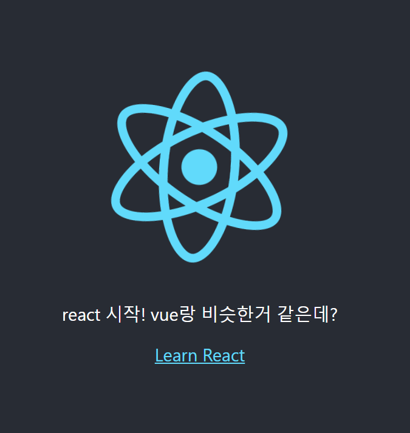
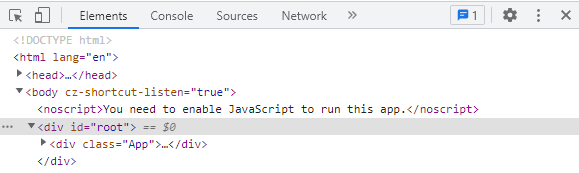
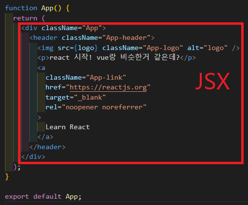

# 코딩앙마 React강의

💡 create-react-app / 컴포넌트 / JSX공부

## #1 강의 소개

### 배우게 될 내용

- create-react-app

- functional component(컴포넌트 작성법)

- JSX

- ReactHook
  
  - useState
  
  - useEffect

- CRUD
  
  - JSON-Server
  
  - Rest API
  
  - POST / PUT / DELETE

- 영어단어장 만들어볼 예정

## #2 설치 (create-react-app)

### npx create-react-app "프로젝트이름"

- ex) npx create-react-app voca
- npm 아니고 npx인 점 유의!!
- npm에 올라가있는 패키지를 바로 실행시켜서 설치해주는 도구

### npm start : 자동으로 브라우저(리액트 웹 페이지) 실행됨


### 프로젝트 구조



- **node_modules** : 프로젝트를 시작할 때 사용되는 dependency 모듈들이 모두 모여있음(package.json 내의 "dependencies"에 기록되어 있는 내용 설치되어 있어서 git에 올릴 때 해당 폴더를 올리지 않더라도 npm install만 해 주면 그대로 다시 설치 되는 시스템!)

- **public**
  
  
  
  - index.html : id가 root인 div 존재! 리액트 코드가 실행되서 만들어진 게 구현됨
  
  - 나머지 파일들은 그렇게 중요하지 않다.

- **src** : 대부분의 작업들이 이 폴더 내에서 진행될 것!
  
  
  
  - test파일은 이 강의에서 다루지 않으므로 삭제
  
  - **index.js**
    
    
    
    *App.js 불러오는 부분*
    
    ```javascript
    import App from "./App";
    ```
    
    *public > index.html 내 root div에 react App을 렌더링*
    
    ```javascript
    const root = ReactDOM.createRoot(document.getElementById("root"));
    root.render(
      <React.StrictMode>
        <App />
      </React.StrictMode>
    );
    ```
    
    reportWebVitals() : 퍼포먼스 관련 부분인데 이 강의에서는 필요없으니 삭제
  
  - **App.js** : npm start 시 보이는 웹 페이지 화면이 여기서 구현된 내용임
    
    
    
    **Hot Module Replacement(HMR)** : App.js에서 뭔가를 작성하거나 수정, 삭제하게 되면 브라우저에 바로 반영이 됨! (아래 이미지 참고)
    
    
    
    *browser 개발자도구  **root/App div** 확인 가능*
    
    
    
    App.js에서 div의 속성명이 class가 아니라 className인 이유 : class가 자바스크립트의 예약어라서 사용할 수 없음. JSX (자바스크립트 내부에 html처럼 작성하는 것) 다룰 때 한 번 더 설명 예정

## #3 컴포넌트, JSX

### 컴포넌트


리액트로 만든 페이지는 여러 개의 컴포넌트들로 구성되어 있다. 위 이미지에서 빨간 네모로 표시한 블록 하나하나(뉴스블록)는 모두 동일한 역할을 수행하기 때문에, 뉴스 컴포넌트를 만들어 각 부분들에 재사용할 수 있도록 한 것이다. 이는 뷰와 동일하다. 리액트에서 모든 컴포넌트는 대문자로 시작해야 하며, JSX를 반환하는 함수이다.  (아래에서 좀 더 자세히 살펴보자)

### App.js



처음 리액트 프로젝트를 생성했을 때에는 하나의 컴포넌트(App)만 존재한다.

App 컴포넌트 역시 함수로 만들어져 있다. default로 export 되고 있으며, 이를 index.js에서 import해서 사용하고 있는 것이다! 이렇게 함수로 만들어진 컴포넌트를 함수형 컴포넌트라고 한다.

이 함수가 return하는 것은 HTML처럼 생긴 **JSX(JavaScript XML)** 이다. HTML을 다뤄봤다면 쉽게 적응 할 수 있을 것이다.

##### JSX 내에서 style 속성은 객체 형태로 전달한다

```javascript
function App() {
  return (
    <div className="App">
      <h1
        style={{
          color: "red",
          backgroundColor: "yellow",
        }}
      >
        Hello, World
      </h1>
    </div>
  );
}
```

*> 결과*


##### return문 전, 변수를 선언해 JSX 내에서 {중괄호}로 사용할 수 있다.

##### {중괄호} 내 간단한 숫자 연산도 가능하다. 숫자와 문자 타입 인식에는 문제 없음!

```javascript
function App() {
  const name = "Tom";
  return (
    <div className="App">
      <h1
        style={{
          color: "red",
          backgroundColor: "yellow",
        }}
      >
        Hello, {name}, <p>{2 + 3}</p>
      </h1>
    </div>
  );
}
```

*> 결과*


##### {중괄호} 내 Boolean 타입이나 객체는 표현할 수 없다.

```javascript
function App() {
  const user = {
    name: "Jane",
  };
  return (
    <div className="App">
      <h1
        style={{
          color: "red",
          backgroundColor: "yellow",
        }}
      >
        <p>{user}</p>
      </h1>
    </div>
  );
}
```

*> 결과 : Objects are not valid as a React child 오류 발생*

{user.name} 으로 사용하면 접근 가능!

##### 객체 내의 정보를 사용하고 싶다면 프로퍼티로 접근 (점표기법/대괄호)

```javascript
function App() {
  const name = "Tom";
  const naver = {
    name: "네이버",
    url: "https://naver.com",
  };
  return (
    <div className="App">
      <h1
        style={{
          color: "red",
          backgroundColor: "yellow",
        }}
      >
        Hello, {name}, <p>{2 + 3}</p>
      </h1>
      <a href={naver.url}>{naver.name}</a>
    </div>
  );
}
```

*> 결과*


