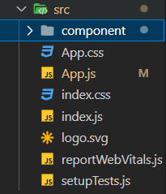
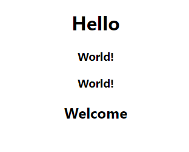
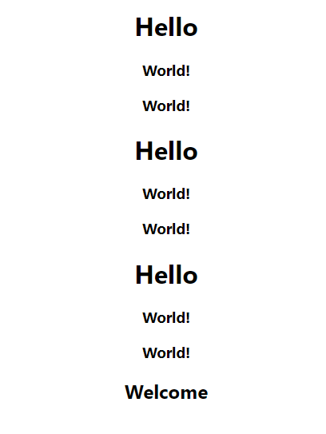
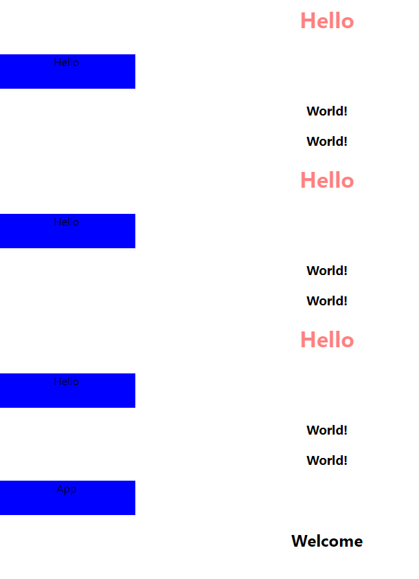
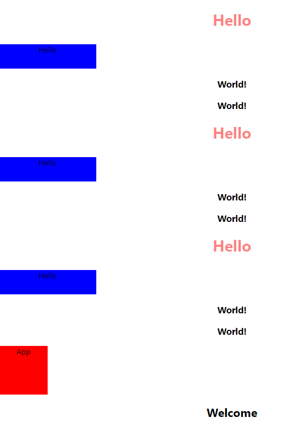
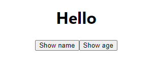
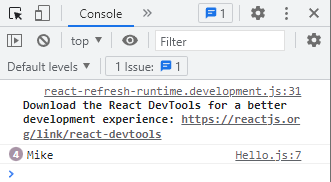
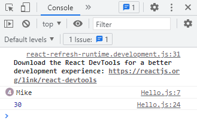
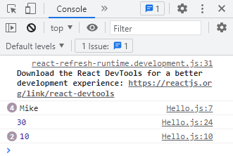
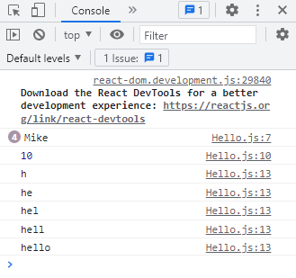

# 코딩앙마 React강의

💡 컴포넌트 만들기 / CSS작성 / 이벤트 처리 / state, useState / props

## #4 첫 컴포넌트 만들기

### 컴포넌트 만들기



src > component 폴더 생성 : 새로 만드는 모든 컴포넌트 관리는 여기서 한다!


##### Hello.js 컴포넌트 생성

```javascript
const Hello = function () {
  return <h1>Hello</h1>;
};

export default Hello;
```

화살표 함수 사용 방법

```javascript
const Hello = () => {
  return <h1>Hello</h1>;
};
```

export default 뒤에 바로 함수 선언하는 방법

```javascript
export default function Hello() {
  return <h1>Hello</h1>;
}
```

→ 어떤 방법을 사용해도 좋다! 본인이 편한 방법을 사용하자.


*App.js*

```javascript
import Hello from './component/Hello';


function App() {
  return (
    <div className="App">
      <Hello />
    </div>
  );
}
```

만든 컴포넌트를 사용할 때에는 사용하고 싶은 곳에서 import 후 html태그처럼 사용하면 된다. 자동 import 기능이 있기 때문에 JSX 내에 <Hello/>만 사용해주면 import문이 알아서 작성된다. <Hello><Hello/>가 기본 형태이지만, 중간에 더 추가해줄 내용이 없다면 <Hello/> 처럼 작성해주는 것이 좋다.

*> 결과*


##### Welcome.js 컴포넌트 생성

```javascript
export default function Welcome() {
  return <h2>Welcome</h2>;
}
```

*App.js*

```javascript
import "./App.css";
import Hello from "./component/Hello";
import Welcome from "./component/Welcome";

function App() {
  return (
    <div className="App">
      <Hello />
      <Welcome />
    </div>
  );
}
```

*> 결과*


##### World.js 컴포넌트 만들기

```javascript
export default function World() {
  return <h3>World!</h3>;
}
```

*Hellos.js*

```javascript
import World from "./World";

const Hello = function () {
  return (
    <div>
      <h1>Hello</h1>
      <World />
      <World />
    </div>
  );
};
```

이렇게 하나의 컴포넌트 내에서 다른 컴포넌트를 사용할 수도 있다. 이 때 return 내 JSX는 하나의 태그만 수용 가능하므로 모든 태그들을 하나의 div로 감싸주지 않으면 에러가 난다. (빈 태그 <></>로 감싸줘도 됨)

*> 결과*



*App.js*

```javascript
import "./App.css";
import Hello from "./component/Hello";
import Welcome from "./component/Welcome";

function App() {
  return (
    <div className="App">
      <Hello />
      <Hello />
      <Hello />
      <Welcome />
    </div>
  );
}
```

*> 결과*



 이렇게 <mark>**한번 만들어 둔 컴포넌트는 어디에든, 몇 번이든 재사용이 가능**</mark>하다.


## #5 CSS작성

### 1. inline-style 사용

```javascript
const Hello = function () {
  return (
    <div>
      <h1
        style={{
          color: "#f00",
          borderRight: "2px soloid #000",
          marginBottom: "30px",
          opacity: 0.5,
        }}
      >
        Hello
      </h1>
      <World />
      <World />
    </div>
  );
};
```

css파일을 따로 작성할 필요 없이 html 태그 내에 객체 형태로 작성하면 된다. 이 때 주의할 점은 속성명에 하이픈(-)을 사용하면 안되고, camelCase로 작성해 주어야 한다는 점이다. value가 숫자형태라면 그대로 작성해 주면 되고, 그 외의 경우에는 따옴표로 감싸주어야 한다.


### 2. 프로젝트 내에 생성되는 css 파일 사용 (App.css/index.css)

- index.css : 전체 프로젝트에 영향을 미치는 css

- App.css : 컴포넌트에 한정적으로 영향을 미치는 css 파일

하지만 이 css파일을 사용할 경우 문제점이 하나 있는데, App.css 파일은 사실 App 컴포넌트에만 영향을 미치는 게 아니다. 예시를 통해 살펴보자.

*App.css*

```css
.box {
  width: 100px;
  height: 100px;
  background-color: red;
}
```

*App.js*

```javascript
import "./App.css";
import Hello from "./component/Hello";
import Welcome from "./component/Welcome";

function App() {
  return (
      <Hello />
      <Hello />
      <Hello />
      <div className="box">App</div>
      <Welcome />
    </div>
  );
}
```

*Hello.css*

```css
.box {
  width: 200px;
  height: 50px;
  background-color: blue;
}
```

*Hello.js*

```javascript
import World from "./World";
import "./Hello.css";

const Hello = function () {
  return (
    <div>
      <h1
        style={{
          color: "#f00",
          borderRight: "2px soloid #000",
          marginBottom: "30px",
          opacity: 0.5,
        }}
      >
        Hello
      </h1>
      <div className="box">Hello</div>
      <World />
      <World />
    </div>
  );
};
```

*> 결과*



이렇게 Hello.css와 App.css를 다르게 작성했는데, Hello.css에 작성된 css 스타일이 모두 작성된 것을 확인할 수 있다. css 파일이 중첩되어서 App.css에 작성한 css 스타일은 무시된 것. 그러면 이걸 어떻게 해결할 수 있을까?


### 3. css 모듈 활용해 각 컴포넌트에 특화된 css 파일 작성

**<mark>컴포넌트 이름.module.css</mark>** 파일에 css 코드를 작성한 후, 해당 컴포넌트에서 해당하는 css파일을 import한다. 그리고 스타일을 적용하고자 하는 태그 내에서 <mark>**className={styles.클래스명}**</mark>을 작성해 주면 해당 css 스타일을 적용시킬 수 있다. 

*Hello.module.css*

```css
.box {
  width: 200px;
  height: 50px;
  background-color: blue;
}
```

*Hello.js*

```javascript
import World from "./World";
import styles from "./Hello.module.css";

const Hello = function () {
  return (
    <div>
      <h1
        style={{
          color: "#f00",
          borderRight: "2px soloid #000",
          marginBottom: "30px",
          opacity: 0.5,
        }}
      >
        Hello
      </h1>
      <div className={styles.box}>Hello</div>
      <World />
      <World />
    </div>
  );
};
```

*App.module.css*

```css
.box {
  width: 100px;
  height: 100px;
  background-color: red;
}
```

*App.js*

```javascript
import "./App.css";
import Hello from "./component/Hello";
import Welcome from "./component/Welcome";
import styles from "./App.module.css";

function App() {
  return (
    <div className="App">
      <Hello />
      <Hello />
      <Hello />
      <div className={styles.box}>App</div>
      <Welcome />
    </div>
  );
}
```

*> 결과*



이 방법을 사용하면 동일한 class명을 사용하더라도 서로 css파일이 중복될 걱정이 없다. 실제 프로젝트에 적용해보면 굉장히 편하다. 프로젝트 크기가 커지면 사실 가장 고민인 부분이 네이밍 부분과 상속(overiding)이기 때문에 이 방식을 사용하면 그런 문제를 확실하게 해결할 수 있다는 장점이 있다. global로 관리 되는 것이 아니라, 컴포넌트 단위로 관리되는 것도 장점! 

BUT, 이번 프로젝트에서는 만들려고 하는 컴포넌트가 많지 않기 때문에 그냥 index.css에 css 코드 모두 입력하는 것으로 통일함!


## #6 이벤트 처리

*App.js*

```javascript
import "./App.css";
import Hello from "./component/Hello";

function App() {
  return (
    <div className="App">
      <Hello />
    </div>
  );
}
```

*Hello.js*

```javascript
const Hello = function () {
  return (
    <div>
      <h1>Hello</h1>
      <button>Show name</button>
      <button>Show age</button>
    </div>
  );
};
```

*> 결과*




### 1. 미리 함수를 만들어 놓고 전달해주는 방법

*Hello.js*

```javascript
const Hello = function () {

  function showName() {
    console.log("Mike");
  }

  return (
    <div>
      <button onClick={showName}>Show name</button>
    </div>
  );
};
```

이벤트(onClick)는 camelCase로 작성해야 한다! 전달하려는 함수는 문자열이 아니기 때문에 중괄호에 넣어주어야 한다. {showName()} 이런식으로 사용할 경우, 해당 함수가 반환하는 값을 전달하기 때문에 원하는 결과가 나오지 않는다는 점 유의!

*> 결과*




### 2. 이벤트 파라미터로 전달해주는 {중괄호} 내부에 직접 함수 작성

*Hello.js*

```javascript
const Hello = function () {
  return (
    <div>
      <button
        onClick={() => {
          console.log(30);
        }}
      >
        Show age
      </button>
    </div>
  );
};
```

*> 결과*




##### 이벤트 발생 시 실행되는 함수에 매개변수 전달하기

이 방법의 장점은 매개변수를 전달하기 편하다는 것이다. 아래 코드에서는 age라는 매개변수를 받는 showAge 함수를 새로 만들고, button 태그 내에서 10을 매개변수로 전달해주었다.

*Hello.js*

```javascript
const Hello = function () {
  function showAge(age) {
    console.log(age);
  }
  return (
    <div>
      <button
        onClick={() => {
          showAge(10);
        }}
      >
        Show age
      </button>
    </div>
  );
};
```

*> 결과*




### Input 태그에 입력한 값 출력하기

input태그에 값을 입력할 때마다 그 값을 콘솔에 출력하려면 어떻게 해야할까? showText 함수는 onChange e(vent)를 매개변수로 받고, **e.target.value**로 input에 입력되는 값을 출력할 수 있다.

- e.target : 이벤트의 타겟, 아래 코드에서는 input태그

*Hello.js*

```javascript
const Hello = function () {
  function showText(e) {
    console.log(e.target.value);
  }
  return (
    <div>
      <input type="text" onChange={showText}/>
    </div>
  );
};
```

*> 결과*



동일한 동작을 하는 함수를 2번 방법으로도 작성할 수 있다.

```javascript
const Hello = function () {
  function showText(e) {
    console.log(e.target.value);
  }
  return (
    <div>
      <input type="text" onChange={(e) => {
        console.log(e.target.value)
      }} />
    </div>
  );
```

showText 함수를 활용하는 방법?

```javascript
const Hello = function () {
  function showText(txt) {
    console.log(txt);
  }
  return (
    <div>
      <input type="text" onChange={(e) => {
        console.log(e.target.value)
      }} />
      <input
        type="text"
        onChange={(e) => {
          const txt = e.target.value;
          showText(txt);
        }}
      />
    </div
```

→ 이것도 그냥 본인이 편한 방법 사용하면 될듯
