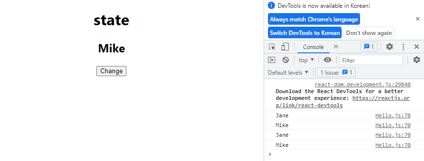
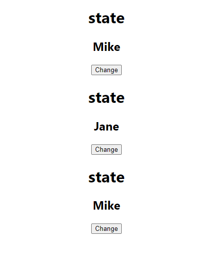
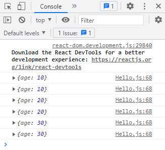
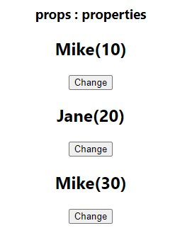
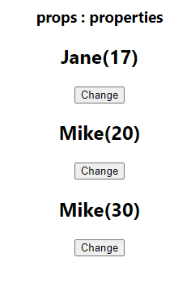
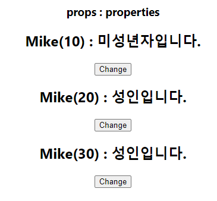
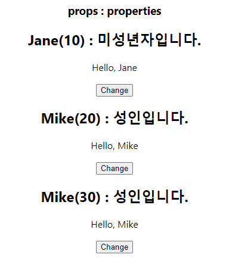

# 코딩앙마 React강의

💡 state, useState / props

## #7 state, useState

### state

컴포넌트가 갖고 있는 속성값. 이 속성값이 변하면 리액트가 자동으로 UI를 업데이트 시켜준다. state만 잘 관리해줘도 화면 재렌더링에는 신경을 쓰지 않아도 되는 편리함이 있다. 


*Hello.js*

```javascript
export default function Hello() {
  let name = "Mike";

  function changeName() {
    name = name === "Mike" ? "Jane" : "Mike";
    console.log(name)
  }

  return (
    <div>
      <h1>state</h1>
      <h2>{name}</h2>
      <button onClick={changeName}>Change</button>
    </div>
  );
}
```

changeName 함수는 name이 Mike일때는 Jane으로, Jane일 때는 Mike로 바꿔준다.

*> 결과*



change 버튼 눌러도 웹페이지에 표시되는 이름이 바뀌지는 않는다. 함수도 만들어놨고 이벤트에 연결도 시켜줬고, 콘솔에서는 정상적으로 이름이 바뀌어서 출력되는데 왜 그런거지? 


##### 바닐라 자바스크립트로 해결해보기

*Hello.js*

```javascript
export default function Hello() {
  let name = "Mike";

  function changeName() {
    name = name === "Mike" ? "Jane" : "Mike";
    console.log(name);
    document.getElementById("name").innerText = name;
  }

  return (
    <div>
      <h1>state</h1>
      <h2 id="name">{name}</h2>
      <button onClick={changeName}>Change</button>
    </div>
  );
}
```

바닐라 자바스크립트로 작업한다면 changeName함수 내에서, name 변수가 변경되었을 때 DOM 업데이트 작업을 수행해 주어야 한다. 코드를 이렇게 작성하고 테스트 해보면 웹페이지 내에 표시되는 이름도 변경되는 것을 확인할 수 있다. 현재 코드 내에 작성된 "name"은 state가 아니라, 단순히 변수일 뿐이다. 컴포넌트가 관리하고 있는 상태값이 아니므로 리액트가 이를 인지하지 못하고 UI를 업데이트 해 주지 않는 것이다.


##### useState : state 사용해보기

리액트 Hook 중 하나인 useState! 초기 리액트는 state와 lifecycle을 관리하려면 클래스형 컴포넌트를 사용했어야 했고, 단순히 UI만 관리해주는 컴포넌트만 함수형으로 제작했었다. 하지만 16.8 버전부터는 모든 컴포넌트를 함수형으로 만들 수 있게 되었다! 함수형 컴포넌트에서도 state와 lifecycle 관리가 가능해졌다. 리액트에는 여러가지 Hook들이 존재하지만, 강의에서는 서비스를 개발하면서 주로 사용하는 Hook만 다룰 예정이다. 더 자세한 내용이 궁금하다면 아래 링크를 참고해보자.

**useState : state(상태값) 관리를 위해 사용하는 Hook**

[리액트 Hooks란? / 사용법]([[React] React Hooks란? / 사용법 ( useState, useEffect 등등.. )](https://defineall.tistory.com/900))


**리액트에서 useState import**

```javascript
import { useState } from "react";
```


**useState 사용법 (배열구조분해)**

```javascript
const [state, state를 변경해주는 함수] = useState("초기값")
```

useState는 배열을 반환한다. state를 변경해주는 함수가 호출되어서 state가 바뀌면, 리액트는 해당 컴포넌트를 다시 렌더링 해 준다. 이 때 useState의 매개변수로는 초기값을 전달해 주면 된다.


*Hello.js*

```javascript
import { useState } from "react";

export default function Hello() {
  const [name, setName] = useState("Mike");

  function changeName() {
    const newName = name === "Mike" ? "Jane" : "Mike";
    setName(newName)
  }

  return (
    <div>
      <h1>state</h1>
      <h2 id="name">{name}</h2>
      <button onClick={changeName}>Change</button>
    </div>
  );
}
```

버튼을 눌렀을 때 changeName함수가 실행되고, setName함수가 호출 되어서 name이 newName으로 바뀌면, 리액트는 현재 컴포넌트를 다시 렌더링 해 준다. (정상적으로 웹페이지에 표시되는 이름도 바뀜)


```javascript
function changeName() {
  setName(name === "Mike" ? "Jane" : "Mike");
}
```

이렇게나

```javascript
  return (
    <div>
      <h2 id="name">{name}</h2>
      <button onClick={() => {
          setName(name === "Mike" ? "Jane" : "Mike")
  }}>Change</button>
    </div>
  );
```

이렇게 사용할 수도 있다. 동작은 같지만 여러가지 코드 형태를 사용할 수 있도록 연습해 보자.


*App.js*

```javascript
function App() {
  return (
    <div className="App">
      <Hello />
      <Hello />
      <Hello />
    </div>
  );
}
```

*> 결과*



첫번째, 세번째 state는 여전히 Mike이지만 두번째 state는 버튼을 클릭해 Jane으로 변경해 주었다. 이렇게 동일한 컴포넌트더라도, state는 각각 관리된다는 사실을 기억해 두자.


## #8 props

property의 약자로, **속성값**을 의미한다. 상태값을 의미했던 state와 어떻게 다른지에 유의하며 공부해보자.

*App.js*

```javascript
function App() {
  return (
    <div className="App">
      <h3>props : properties</h3>
      <Hello age={10} />
      <Hello age={20} />
      <Hello age={30} />
    </div>
  );
}
```

Hello 컴포넌트에 age라는 값을 전달해보자. 이 때 ""를 사용하지 않은 것은 숫자를 그대로 전달해 주기 위해서이다. 이렇게 전달해준 age값을 어떻게 사용해 주느냐?

*Hello.js*

```javascript
export default function Hello(props) {
  console.log(props);
 ...
}
```

함수형 컴포넌트를 만들어 줄 때, 매개변수로 전달 받는 값이 아무것도 없었는데, App.js에서 전달해준 props값이 전달되어 들어온다. **Hello(props)** 이 props 값을 확인 해 보기 위해 콘솔 창에 출력해 주면, 객체 형태로 값이 잘 전달된 것을 확인할 수 있다.

*> 결과*




*Hello.js*

```javascript
  return (
    <div>
      <h2>{name}({props.age})</h2>
      <button onClick={changeName}>Change</button>
    </div>
  );
```

*> 결과*



props로 전달해 주었던 age값이 잘 반영된 것을 확인할 수 있다. 이 값은 컴포넌트 내부에서 변경할 수 없고, 넘겨받은 그대로 사용해야 한다. 만약 값을 변경하고 싶다면 컴포넌트 내부에서 state를 다시 만들어 주어야 한다.


##### 컴포넌트 내부에서 props의 값을 변경하고 싶을 때 : state 사용

*Hello.js*

```javascript
export default function Hello(props) {
  console.log(props);
  const [name, setName] = useState("Mike");
  const [age, setAge] = useState(props.age);

  return (
    <div>
      <h2>{name}({age})</h2>
      <button
        onClick={() => {
          setName(name === "Mike" ? "Jane" : "Mike");
          setAge(age + 1);
        }}
      >
        Change
      </button>
    </div>
  );
```

state의 초기값은 전달받은 props의 age값, 버튼을 클릭할 때 마다 age를 1씩 증가시켜주는 setAge함수를 실행시켜 준다. 넘겨받은 값을 변경시켜주는 게 아니라, 그 값을 state로 다시 관리해 주고 있는 것! props.age = 100 이런식으로 props 값을 바꿔주려고 하면 오류 뜸!

*> 결과*



*Hello.js*

```javascript
export default function Hello({ age }) {
  const [name, setName] = useState("Mike");

  return (
    <div>
      <h2>{name}({age})</h2>
    </div>
  );
}
```

이렇게도 작성가능하다.


##### props로 받아온 값을 조건문에 사용해 메시지 띄워주기

*Hello.js*

```javascript
export default function Hello({ age }) {
  const [name, setName] = useState("Mike");
  const msg = age > 19 ? "성인입니다." : "미성년자입니다.";

  return (
    <div>
      <h2>{name}({age}) : {msg}</h2>
    </div>
  );
}
```

*> 결과*




##### 컴포넌트가 가지고 있는 state를 props로 넘기기

*UserName.js*

```javascript
export default function UserName({ name }) {
  return <p>Hello, {name}</p>;
}
```

이름을 받아서 화면에 띄워주기만 하는 컴포넌트를 하나 만들어 준다.

*Hello.js*

```javascript
import { useState } from "react";
import UserName from './UserName';

export default function Hello({ age }) {
  const [name, setName] = useState("Mike");
  const msg = age > 19 ? "성인입니다." : "미성년자입니다.";

  return (
    <div>
      <h2>{name}({age}) : {msg}</h2>
      <UserName name={name}/>
      <button
        onClick={() => {
          setName(name === "Mike" ? "Jane" : "Mike");
        }}
      >
        Change
      </button>
    </div>
  );
}
```

name은 Hello 컴포넌트 입장에서는 state이지만, UserName 입장에서는 props이다.

*> 결과*




# 
