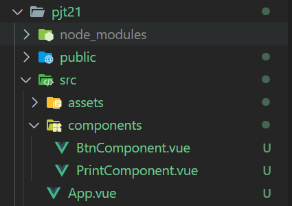
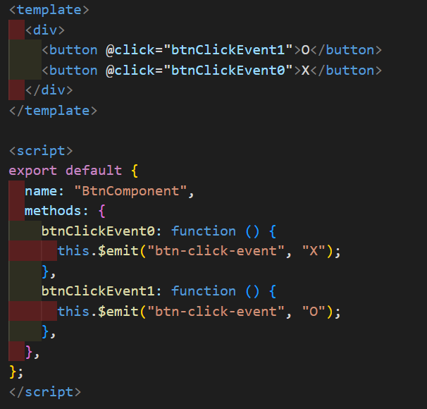
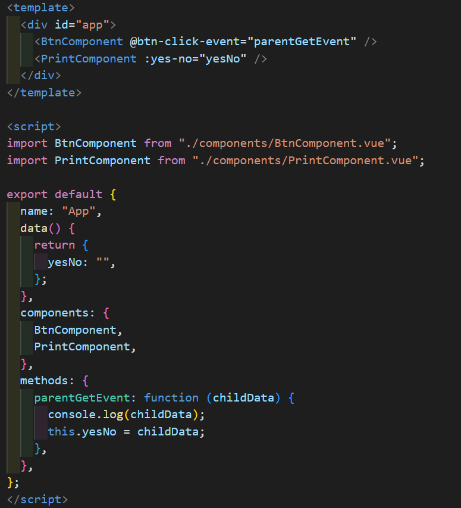
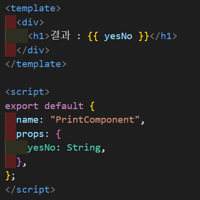
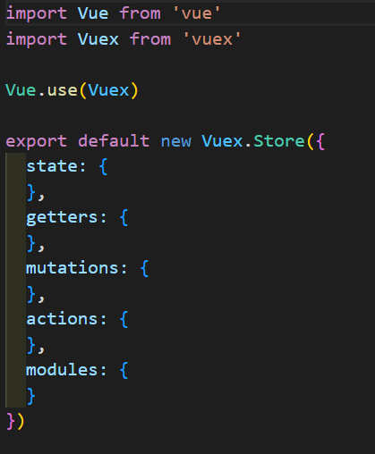
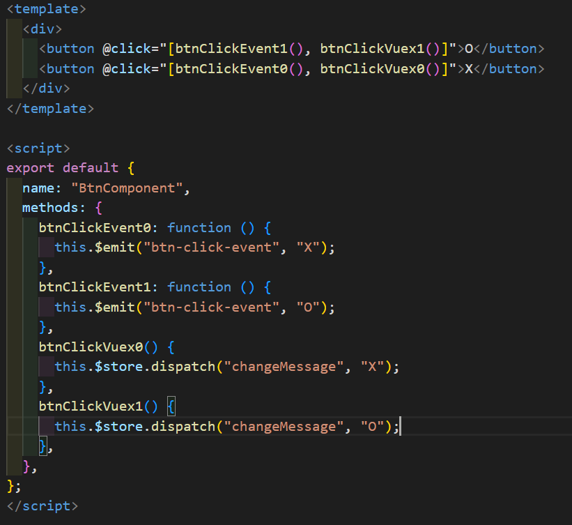
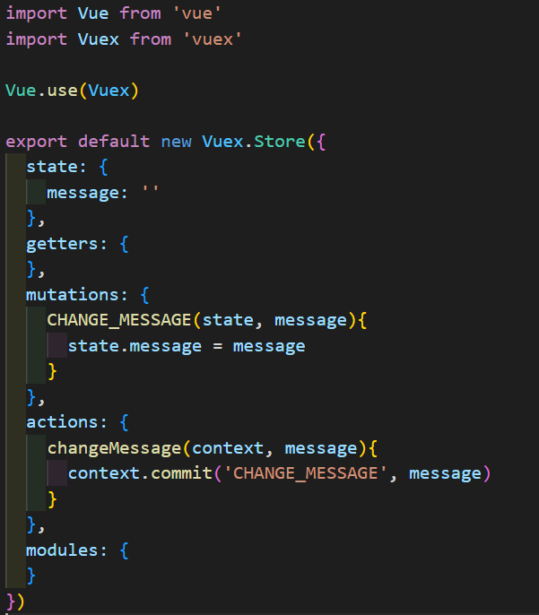
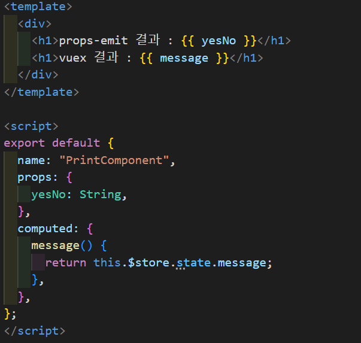
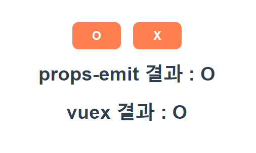
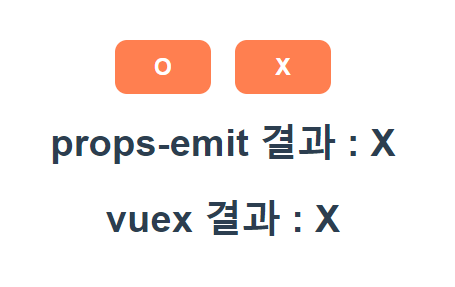

# 선택PJT21 - Vue의 데이터 전송 방법

### Vue 프로젝트 생성 및 서버 구동

```bash
vue create pjt21
cd pjt21
npm run serve
```

### App.vue의 하위 컴포넌트 생성



* O/X 버튼을 누를 수 있는 **BtnComponent**

* BtnComponent에서 받아온 데이터를 출력해줄 **PrintComponent**

### 컴포넌트 이름 설정 및 컴포넌트 등록

```javascript
/* BtnComponent.vue */
<template>
  <div>
    <button>O</button>
    <button>X</button>
  </div>
</template>

<script>
export default {
    name "BtnComponent",
}
</script>
```

```javascript
/* PrintComponent.vue */
<template>
  <div>
    <h1>결과 : </h1>
  </div>
</template>

<script>
export default {
    name "PrintComponent",
}
</script>
```

* 편의를 위해 각 컴포넌트 이름은 파일명과 통일시켜 주었음

* BtnComponent에는 O/X버튼을 template에 추가

* PrintComponent에는 클릭 결과를 출릭해줄 h1 태그를 추가

```javascript
/* App.vue */
<template>
  <div id="app">
    <BtnComponent/>
    <PrintComponent/>
  </div>
</template>

<script>
import BtnComponent from "./components/BtnComponent.vue";
import PrintComponent from "./components/PrintComponent.vue";

export default {
  name: "App",
  components: {
    BtnComponent,
    PrintComponent,
  },
};
</script>
```

* App.vue에 하위 컴포넌트 등록 및 템플릿에서 사용

* 정상적으로 출력되는지 확인 필요!

-------

### props, emit 활용해 데이터 전송하기

**props**  : 부모 → 자식 컴포넌트로 데이터 전송

**emit** : 자식 컴포넌트 → 부모로 데이터 전송

*BtnComponent.vue*



* App.vue의 하위 컴포넌트인 BtnComponent.vue에서 App.vue로 
  데이터를 보내주어야 하므로 **emit** 이벤트를 사용해 주어야 한다.

* 버튼마다 클릭이벤트를 부착했다.

* 버튼 클릭 시 $emit('이벤트명', '함께 전달해줄 데이터') 메서드 실행

* O / X 버튼 별로 실행되는 메서드가 다르게 설정하는 것이 포인트!!

*App.vue*



* 하위 컴포넌트인 BtnComponent.vue에서 버튼 클릭이벤트가 발생하면, 'btn-click-event'가 실행된다.

* emit 이벤트와 함께 전달된 데이터를 또 다른 자식 컴포넌트, PrintComponent에 전달해 주어야 하므로, 자식에게 전달해줄 임의의 데이터 **'yesNo'** 를 빈 문자열로 설정해 주었다.

* 'btn-click-event'라는 emit이벤트가 발생하면 parentGetEvent 메서드가 실행되고, BtnComponent에서 전달받은 데이터(childData)를 yesNo에 할당시켜 준다. 

* console.log(childData)는 데이터 값을 확인하기 위해 적은 코드이므로 없어도 무관하다.

* yesNo에 저장된 데이터를 자식 컴포넌트로 넘겨주기 위해, v-bind를 사용하였다.

*PrintComponent.vue*



* props에 부모 컴포넌트로부터 전달받은 데이터 이름과 데이터 타입을 선언하고, template에서 사용해 주면 끝!

----

### global event bus 활용해 데이터 전송

이전에는 vue 공식 문서에서 Eventbus를 기록하고 있었으나, 현재는 event bus에 대한 기록이 없다. 시간이 지남에 따라 해당 내용을 제외한 것으로 보아, 추천하는 방법이 아니라고 생각되어 vuex 방식으로 바로 넘어갔다... global event bus 사용하는 방법으로 구글링을 많이 해 보았지만 여전히 사용법을 잘 모르겠어서이기도 하다...😅

-----------

### Vuex 활용해 데이터 전송

```bash
vue add vuex
```

vue 라이브러리 적용 → src 내에 store라는 디렉토리가 생긴다

*store > index.js*



* **state** : 중앙 저장소에서 관리하는 모든 상태 정보 (데이터)

* **mutations** : state를 변경하기 위한 methods

* **actions** : state를 변경하는 것 외의 모든 로직 진행

* **getters** : state를 활용해 계산한 새로운 변수 값

*BtnComponent.vue*



* 버튼 클릭 시 state를 변경할 수 있도록 actions에 정의할 'changeMessage' 함수를 호출하고 데이터를 전달해야 한다.

* 컴포넌트에서 **actions는 dispatch()** 에 의해서 호출된다.

* **dispatch('호출하려는 actions함수명', '넘겨줄 데이터')**

* 버튼을 클릭 할 때 props/emit를 사용한 함수와 vuex를 사용한 메서드 모두 실행 될 수 있게 하기 위해서 클릭 이벤트에 리스트를 사용했다.

*index.js*



* dispatch()에 의해 호출된 actions함수(changeMessage)는 두번째 인자(message)로 dispatch가 넘겨준 데이터를 받는다.

* state의 상태를 바꿔주는 **mutations는 actions에서 commit()** 을 통해 를 호출할 수 있다. 

* **commit('호출하려는 mutations함수', '넘겨줄 데이터')**

* commit에 의해 'CHANGE_MESSAGE' 함수가 호출 되면, state에 정의해 둔 message가 전달 받은 데이터로 바뀐다.

*PrintComponent.vue*



* state에 저장되어 있는 message란 데이터를 computed로 정의한 후, template에서 사용해 주면 끝!!

* props-emit을 사용한 결과와 vuex를 사용한 결과를 모두 확인하기 위해 h1 태그를 두개 만들어 주었다.

-----

### ✨ 결과

**O 버튼 클릭 시**



**X 버튼 클릭 시**


