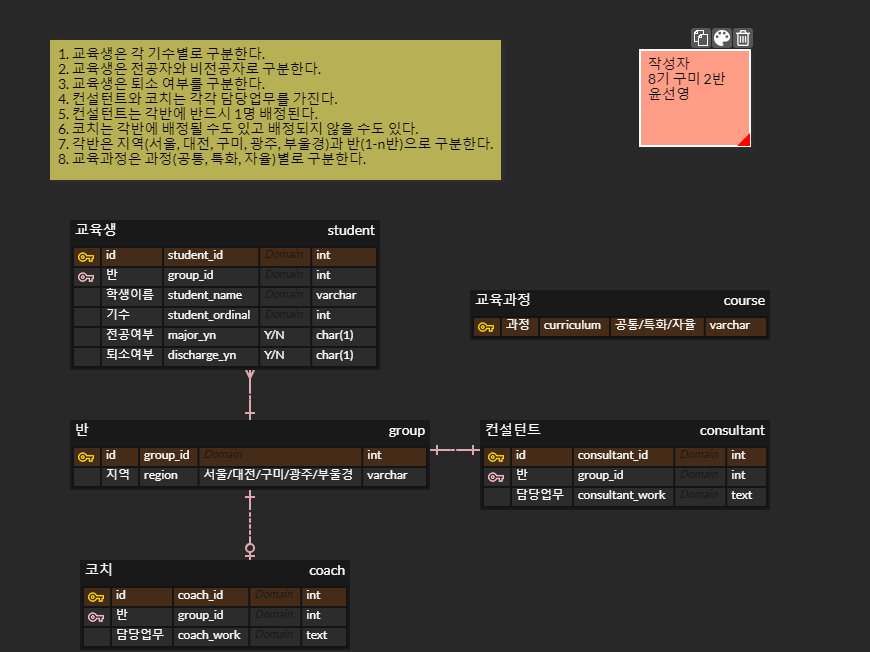

# 필수PJT3 - ERD설계, ERD 작성 실습

----------------

### ERD 작성 내용

---------------

### 🛠 설계 방법

##### 1. 엔티티 추출 후 ERD에 반영

* **교육생 / 반 / 컨설턴트 / 코치 / 교육과정**  

* 5개의 엔티티 有

* 논리 테이블명과 물리 테이블명을 설정해 준다.

##### 2. 속성 추출 후 ERD에 반영

* 교육생은 **이름 / 기수 / 전공여부 / 퇴소여부** 속성을 갖고 있다.

* 반은 **지역** 속성을 갖고 있다.

* 컨설턴트와 코치는 **담당업무** 속성을 갖고 있다.

* 교육과정은 **과정** 속성을 갖고 있다.

* 해당 속성들을 필드명으로 설정해 주고, 데이터 타입도 입력한다.

##### 3. PK값 설정 및 엔티티간 관계선 연결

* 각 엔티티들의 PK값을 id로 설정해 주었다.

* 교육과정의 경우 PK값을 과정이름으로 설정했다.

* 반과 교육생은 **1:N**의 관계를 갖는다.

* 반과 컨설턴트, 반과 코치는 **1:1**의 관계를 갖는다.

* 코치는 반과 **1:1의 관계를 맺지 않을 수도** 있기 때문에, 이를 관계선 연결 시 반영해 주어야 한다.

-----------------------

### 💡 느낀점

1학기 프로젝트 때 ERD 설계 과정에서 많은 어려움이 있었는데, 이번 기회에 조금 더 확실히 ERD 작성 방법에 대해 학습하고 이해할 수 있었습니다. 2학기 프로젝트에서도 오늘 공부한 내용을 잘 활용할 수 있으면 좋을 것 같습니다!
