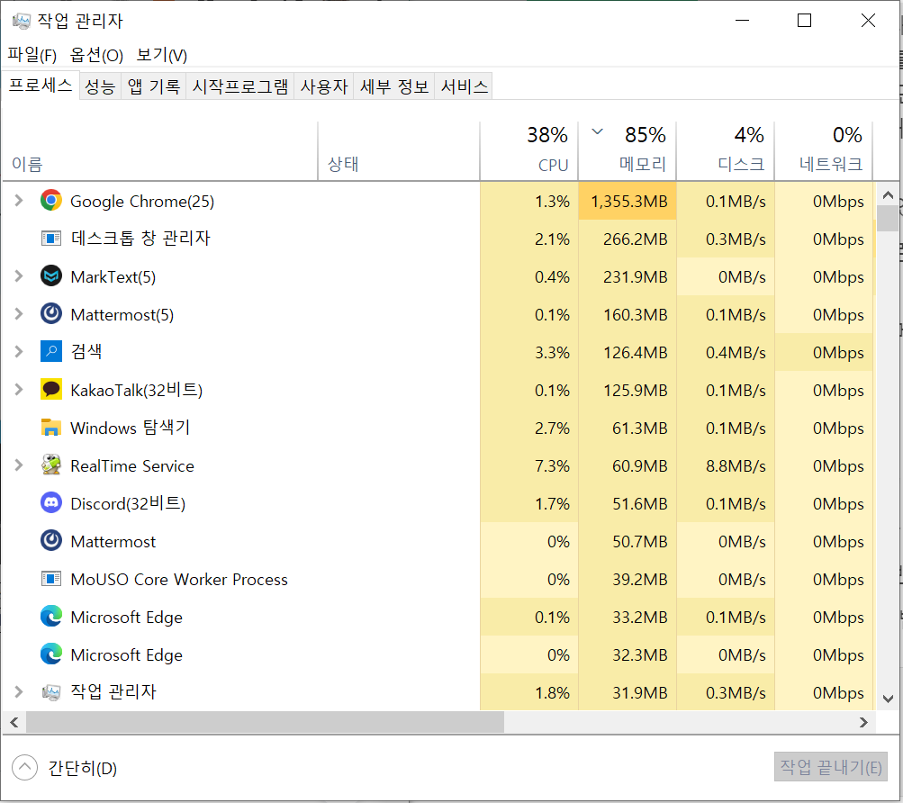

# 필수PJT7- 멀티스레드 채팅 서버 구현

## 1) 운영 체제에 관한 학습 (프로세스와 스레드)

어떤 프로젝트를 진행하더라도 운영체제에 대한 기본적인 이해는 필수!
일반적으로 개발자는 운영체제에 작업 지시를 효율적으로 내려주는 업무를
담당하기 때문에 이에 대한 이해도가 부족하면 많은 어려움을 겪을 수 밖에 없다. 아래와 같은 핵심 개념을 이해해야만 개발자로서 능동적인 시스템 설계와 구현이 가능하게 된다. 

* 운영체제의 핵심 기능에는 어떤 것들이 있는가

* 우리가 평소 사용하는 운영 체제에서 이런 핵심 기능들을 살펴볼 수 있는 방법은 무엇인가

* 내가 사용하는 프로그래밍 언어는 어떤 메커니즘을 통해 운영체제에게 해야할 일을 지시하는가

--------------------

### 운영체제 (Operation System)

* 사용자가 컴퓨터를 사용하기 위해 필요한 소프트웨어

* 컴퓨터를 사용하며 실행한 모든 프로그램들은 OS에서 관리, 제어한다.

* 컴퓨터 시스템의 자원들을 효율적으로 운영 및 관리한다.

* ex) Windows, Linux, Mac OSX, iOS 등

##### 운영체제의 역할

* **컴퓨터의 자원 관리** 
  
  * 컴퓨터의 시스템 자원을 효율적으로 관리한다.
  
  * CPU, 메모리, 디스크, I/O장치와 같은 하드웨어 자원
  
  * 프로세스, 파일 메시지 등의 소프트웨어 자원

* **자원보호**
  
  * 프로그램이나 다른 사용자가 데이터를 삭제하거나 중요 파일에 접근하지 못하도록 컴퓨터 자원들을 보호한다.

* **사용자에게 편의를 제공 (인터페이스 제공)** 
  
  * 하드웨어 인터페이스와 사용자 인터페이스를 제공한다.

##### 운영체제의 기능

* **프로세스 관리** : OS에서 동시에 실행되는 많은 프로세스를 효율적으로 관리

* **파일 관리** : 파일 생성, 수정, 삭제, 조작, 백업 등

* **네트워크 관리** : 네트워크 서비스 성능, 오류분석, 프로비저닝, 품질관리 등

* **메인 메모리 관리** : 메모리 추적, 프로세스에 따른 메모리 할당

* **보조 스토리지 관리** : 스토리지 할당, 여유 광간 관리, 디스크 스케줄링

* **입출력 장치 관리** : 버퍼 캐싱 시스템 제공, 장치 드라이버 제공

* **보안 관리** : 시스템 보호 및 오류로 인한 시스템 손상 방지

* **명령어 해석 시스템** : 사용자와 시스템 간의 인터페이스. 인터프리터, 쉘 등
- 프로세서, 메모리, 입출력 장치, 파일 및 정보 등의 자원 관리

- 시스템 자원 보호 기능

- 효율적인 자원 관리 및 분배를 위한 스케쥴링 기능

- 사용자와 시스템 간의 편리한 인터페이스 제공

- 각종 시스템 하드웨어와 네트워크 관리 및 제어

- 데이터 관리, 공유

- 시스템의 오류 검사 및 복구

- 입출력에 대한 보조기능

- 가상 계산기 능력 제공

##### 운영체제의 구성

* **커널 (kernel)**
  
  * 운영체제의 핵심! **운영체제가 수행하는 모든것**이 저장되어 있다.

* **명령어 해석기 (Command interpreter, shell)**
  
  * 사용자가 커널(운영체제)에 요청하는 **명령어를 해석**하여 커널에 요청하고, 그 **결과를 출력**한다.
  
  * 사용자는 **GUI (Graphical User Interface)** 나 **CLI(Command LIne Interface** 방식으로 운영체제에 명령을 요청할 수 있다.

사용자 프로그램 (Application) 은 특정 운영체제 (ex. window/rinux) 에 맞춰서 만들기 때문에, **한 애플리케이션은 서로 다른 운영체제에서 수행할 수 없다.** 애플리케이션은 운영체제 위에서 수행되기 때문에 하드웨어 자원을 직접적으로 사용하지 않고, 운영체제가 제공하는 자원만을 사용하기 때문이다. 

참고자료)

[https://velog.io/@codemcd/운영체제OS-1.-운영체제란](https://velog.io/@codemcd/%EC%9A%B4%EC%98%81%EC%B2%B4%EC%A0%9COS-1.-%EC%9A%B4%EC%98%81%EC%B2%B4%EC%A0%9C%EB%9E%80)

[[OS] 운영체제란? (운영체제의 역할, 목적, 종류, 기능) :: 코딩 공부 일지](https://cocoon1787.tistory.com/685)

-------------

### 프로세스



* 쉽게 말하면 **'실행 중인 프로그램'**

* 운영체제에 의해 보조 기억장치(하드디스크, SSD)에 존재하는 **'프로그램'이 메모리에 적재되어 CPU에서 실행/제어**되고 있는 상태

* 각 운영체제별 프로세스 조회 및 관리 방법이 제공됨

##### 좀 더 공부해야 할 내용!

* 프로세스에 관한 주요 명령어

* 운영체제별 프로세스 조회 및 관리 방법

참고자료)

[[운영체제(OS)] 3. 프로세스(Process)](https://rebro.kr/172)

[[운영체제] 프로세스가 뭐지? - 멍멍멍](https://bowbowbow.tistory.com/16)

---------------

### 스레드

* **'프로세스 내에서 실제로 작업을 수행하는 주체'**

* 모든 프로세스에는 한 개 이상의 스레드가 존재하여 작업을 수행한다.

* 두 개 이상의 스레드를 가지는 프로세스를 멀티스레드 프로세스라고 한다.

* 프로세스 내에서 실행되는 작업 흐름의 단위
- CPU는 한번에 하나의 명령을 수행하게 되는데 스레드를 활용해 동일 프로세스 내 여러 독립된 작업을 동시에 수행하는 듯한 효과를 볼 수 있음

##### 파이썬에서의 스레드 구현방법

1. threading 모듈

2. thread모듈

파이썬 프로그램은 기본적으로 하나의 스레드에서 실행된다. 코드를 병렬로 실행하기 위해서는 별도의 쓰레드를 생성해야 한다. 일반적으로 thread 모듈 위에서 구현된 threading 모듈을 사용한다. 파이썬에서 쓰레드를 실행하기 위해서는, threading 모듈의 threading.Thread() 함수를 호출하여 Thread 객체를 얻은 후 Thread 객체의 start() 메서드를 호출하면 된다. 

서브쓰레드는 함수 혹은 메서드를 실행하는데, 일반적인 구현방식으로 다음과 같은 방식이 있다.

* 쓰레드가 실행할 함수 혹은 메서드를 작성

```python
import threading

def sum(low, high):
    total = 0
    for i in range(low, high):
        total += i
    print("Subthread", total)

t = threading.Thread(target=sum, args=(1, 100000))
t.start()

print("Main Thread")


# 실행결과
# Main Thread
# Subthread 4999950000
```

* threading.Thread 로부터 파생된 파생클래스를 작성 : Thread 클래스를 파생하여 쓰레드가 실행할 run() 메서드를 재정의해서 사용

```python
import threading, requests, time

class HtmlGetter (threading.Thread):
    def __init__(self, url):
        threading.Thread.__init__(self) 
        self.url = url

    def run(self):
        resp = requests.get(self.url)
        time.sleep(1)
        print(self.url, len(resp.text), ' chars')

t = HtmlGetter('http://google.com')
t.start()

print("### End ###")
```

##### 자바에서의 스레드 구현방법

1. Runnable 인터페이스를 구현하는 방법

2. Thread 클래스를 상속받는 방법

→ 두 방법 모두 스레드를 통해 작업하고 싶은 내용을 run() 메서드에 작성

```java
class ThreadWithClass extends Thread {
    public void run() {
        for (int i = 0; i < 5; i++) {
            System.out.println(getName()); // 현재 실행 중인 스레드의 이름을 반환함.
            try {
                Thread.sleep(10);          // 0.01초간 스레드를 멈춤.
            } catch (InterruptedException e) {
                e.printStackTrace();
            }
        }
    }
}


class ThreadWithRunnable implements Runnable {
    public void run() {
        for (int i = 0; i < 5; i++) {
            System.out.println(Thread.currentThread().getName()); // 현재 실행 중인 스레드의 이름을 반환함.
            try {
                Thread.sleep(10);
            } catch (InterruptedException e) {
                e.printStackTrace();
            }
        }
    }
}


public class Thread01 {
    public static void main(String[] args){
        ThreadWithClass thread1 = new ThreadWithClass();       // Thread 클래스를 상속받는 방법
        Thread thread2 = new Thread(new ThreadWithRunnable()); // Runnable 인터페이스를 구현하는 방법
        thread1.start(); // 스레드의 실행
        thread2.start(); // 스레드의 실행
    }
}
```

##### 스레드 예시 - 동영상 플레이어

- 동일 프로세스 내에서 영상과 사운드 데이터를 동시에 풀어내 각 장치에 전송해 주어야 함!

- 스레드 프로그래밍을 통해 동시(성) 작업이 가능함

##### 좀 더 공부해야 할 내용!

OS 내에서 내가 스레드로 뭔가를 만들어 놓으면 어느 타이밍에 실행되고, 어떻게 관리되는지, 내가 가장 중요하다고 생각하는 스레드가 먼저 처리되었으면 좋겠는데 내 언어에서는/운영체제에서는 이런것들을 어떻게 지원하고, 내가 사용할 수 있을지 생각해볼것!!

참고자료)

[TCP School - 스레드의 개념(자바)](http://www.tcpschool.com/java/java_thread_concept)

[스레드(Thread) - 개념, 사용이유, 프로세스와의 비교, 상태, 우선순위, 종류 :: 으뜸별](https://beststar-1.tistory.com/6)

[[Python] 멀티스레드란? 사용법, 예제 (Multi thread, target, args, start, join)](https://scribblinganything.tistory.com/568)
