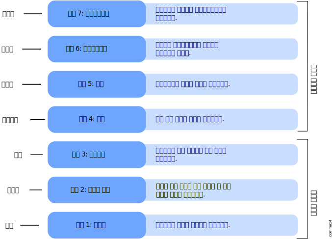

# 필수PJT7- 멀티스레드 채팅 서버 구현

## 2) 네트워크 기본 개념과 socket 통신에 대한 이해

- OSI 7계층, 각 단계에서 정의하고 있는 내용들은 어떤 것인지

- 실제 장치간 통신은 어떻게 전개되는지

- 채팅 서버 구현에 사용될 socket 통신이 어떤 개념인지

- 운영 체제에서는 통신 관련된 내용을 어디까지 커버하는지

스스로 설명이 가능하도록 집중적으로 학습해야함!

### 네트워크

* 두 대 이상의 컴퓨터들을 연결하고 서로 통신할 수 있도록 한 링크의 조합

* 컴퓨터들이 통신기술을 이용해 그물망처럼 연결된 통신 이용 형태

##### OSI 7계층

* 물리계층(Lv1) 
  
  - 전기적, 기계적, 기능적인 특성을 이용해 데이터를 전송
  
  - 데이터는 0과 1의 비트열, 즉 On, Off의 전기적 신호 상태로 이루어져 해당 계층은 단지 데이터를 전달
  
  - 단지 데이터 전달의 역할을 할 뿐이라 알고리즘, 오류제어 기능이 없음
  
  - 통신 케이블, 리피터, 허브 등

- 데이터 링크 계층(Lv2)
  
  - 물리계층을 통해 송수신되는 정보의 오류와 흐름을 관리하여 안전한 통신의 흐름을 관리
  
  - 프레임에 물리적 **주소(MAC address)**를 부여하고 에러검출, 재전송, 흐름제어를 수행
  
  * 이 계층에서 전송되는 단위 : 프레임(Frame)
  
  * 브리지, 스위치, 이더넷 등

* 네트워크 계층(Lv3)
  
  * 
  
  * 데이터를 목적지까지 가장 안전하고 빠르게 전달
    
    - 장비 : **라우터**
  
  - 
    
    - 이 계층에서 전송되는 단위 : **패킷(Packet)**

- 전송계층(Lv4) : TCP

- 세션 계층(Lv5)

- 표현 계층(Lv6)

- 응용 계층(Lv7) : 완전 중요함!! 왜냐? HTTP 때문!!

참고자료)

[IBM Documentation - 네트워크 및 통신개념](https://www.ibm.com/docs/ko/aix/7.2?topic=management-network-communication-concepts)

https://velog.io/@cgotjh/네트워크-OSI-7-계층-OSI-7-LAYER-기본-개념-각-계층-설명

### socket 통신

- 소프트웨어로 작성된 추상적인 개념의 통신 접속점

- 운영체제 레벨에서 제공되어진다고 볼 수 있음

- 내가 선택한 언어에서 소켓 통신을 어떻게 구현할 수 있는가? (찾아봐!)

- 공식 API 문서를 참고하거나 도서, 블로그를 검색해보면 어렵지 않게 소켓 예제를 찾을 수 있다!! 블로그에 정리 되어있으면 꼭 내가 이해하는 과정이 필요함!!

웹소켓! 이라는 단어가 공통 프로젝트 할 때 겁나 많이 등장할거임!!

---

### 실시간 멀티 채팅 서버 프로그램 구현

##### 스레드 프로그래밍

- 클라이언트 프로세스는
  
  - 서버로부터 소켓 통신을 통해 메시지를 읽어들이고 콘설에 출력하는 작업
  
  - 콘솔창의 키보드 입력 텍스트를 소켓 통신을 통해 서버로 전송하는 작업

- 채팅 서버
  
  - 최대 5명까지의 소켓 세션이 유지되고 있는 클라이언트들로부터의 메시지 수신과 송신을 동시에 수행해야 함
  
  - 메시지 수신/송신 두가지 기능을 동시에 처리할 수 있어야 하며, 이 때 필요한 것이 각각의 작업을 동시에 별도 처리할 수 있는 스레드 프로그래밍!

- 소켓과 마찬가지로 선택 언어에서 어떻게 스레드를 활용할 수 있는지와 같이 기본 사용법을 찾아보는 게 개발자의 기본 덕목이다!!
