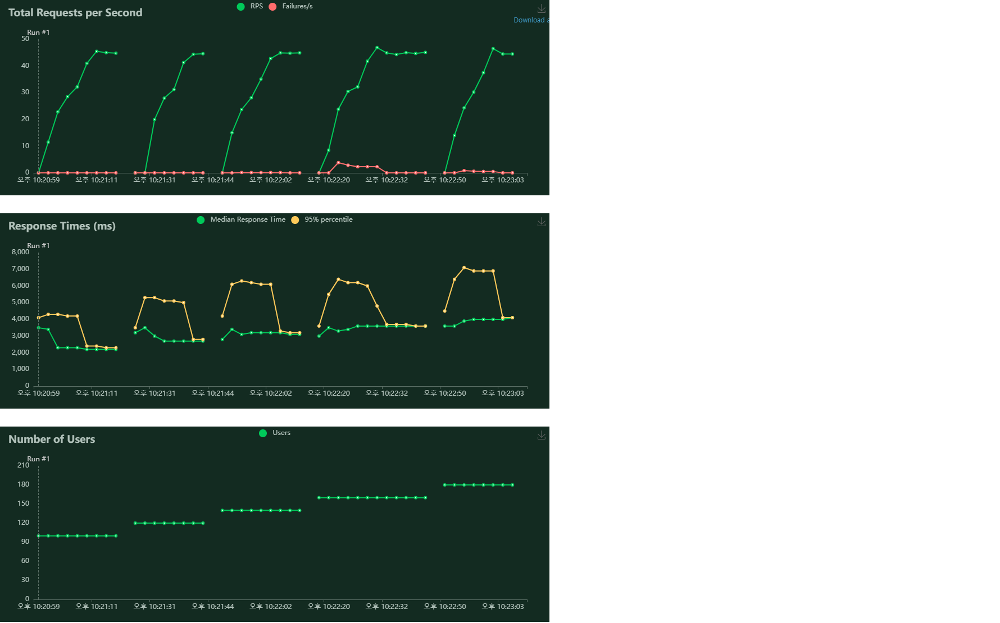
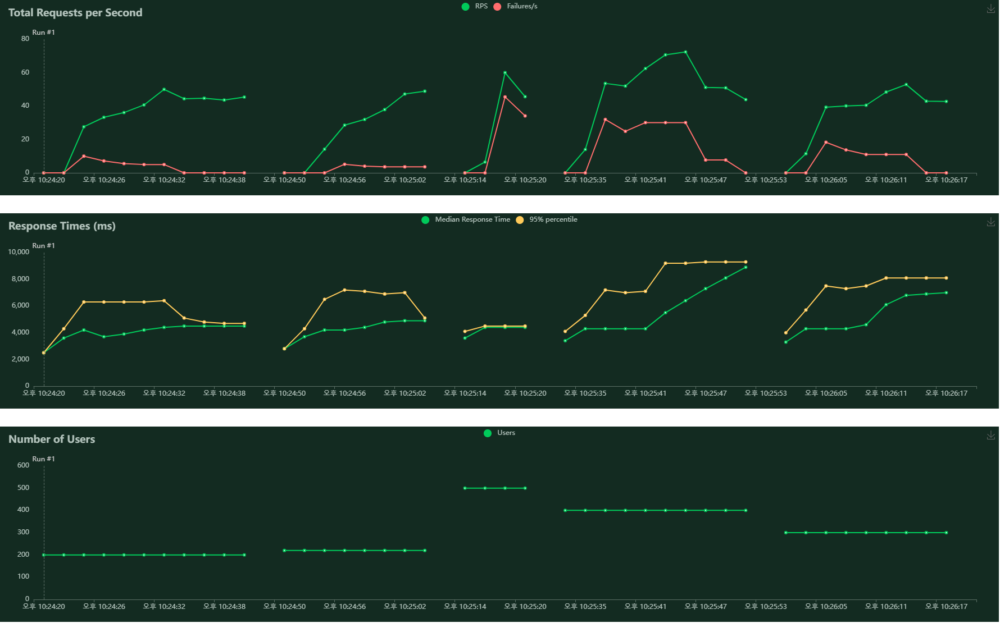

# 필수PJT9 - 부하 테스트 도구를 이용한 웹 페이지 성능 측정

*locustfile.py*

```python
from locust import HttpUser, task

class ServerTest(HttpUser):
    @task
    def api_test(self):
        self.client.get("/community")
```

### 측정 결과





user 수를 100부터 시작해서 20씩 높혀가다가, 220명까지 해 보았음에도 별 무리 없이 서버가 동작하는 것을 확인하였습니다. 이대로 진행하면 시간이 너무 오래 걸릴 듯 하여 500명으로 설정 후(두번째 사진 3번째) 부하 테스트를 진행 했습니다. 그 결과 Failure가 급격히 증가하는 모습이 보였고, 400, 300 순으로 user수를 줄여 나갔습니다. user 수 300명과 280명, 260명으로 테스트를 진행하였을 때에는 failure가 조금 줄어들었고, TPS도 조금 더 안정된 모습을 볼 수 있었습니다. 200명대의 유저 수에서도 실패 케이스가 아예 없는 것은 아니었기 때문에 한계부하를 정확히 측정할 수는 없었습니다만, 대략적으로 200 ~ 300명의 유저수에서 서버가 조금씩 버벅이기 시작하는 것으로 확인되었습니다. 


